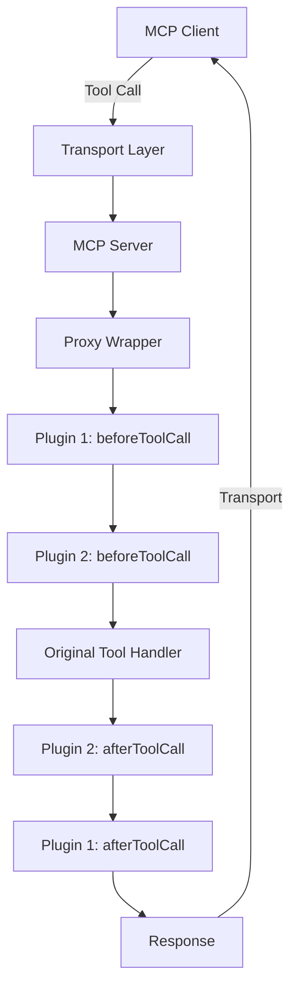

import { Callout } from 'nextra/components'

# MCP Proxy Wrapper

A powerful proxy wrapper for Model Context Protocol (MCP) servers with hooks and plugin system for intercepting, monitoring, and modifying tool calls.

<Callout type="info" emoji="🚀">
  **New!** Check out our [Stripe Monetization Plugin](/plugins/stripe-monetization) to start monetizing your MCP tools instantly.
</Callout>

## What is MCP Proxy Wrapper?

The MCP Proxy Wrapper is a lightweight yet powerful system that allows you to intercept and modify tool calls in Model Context Protocol servers. It provides a clean plugin architecture for adding features like:

- 💰 **Monetization** with Stripe integration
- 🔐 **Authentication** and authorization
- 📊 **Analytics** and monitoring 
- 🛡️ **Rate limiting** and security
- 💾 **Caching** and performance optimization
- 🔄 **Request/response transformation**

## Key Features

### 🔌 Plugin Architecture
- Easy-to-implement plugin interface
- Lifecycle hooks for `beforeToolCall` and `afterToolCall`
- Plugin manager with priority support
- Error handling and logging

### 🚀 Performance
- Minimal overhead on tool calls
- Asynchronous hook execution
- TypeScript-first for excellent developer experience

### 🎯 Transport Agnostic
Works with **all** MCP transport methods:
- **STDIO** (Standard Input/Output)
- **WebSocket** (Real-time web applications)
- **SSE** (Server-Sent Events)  
- **HTTP** (REST-like APIs)
- **InMemory** (Testing and development)

### 💡 Developer Friendly
- Comprehensive TypeScript definitions
- Extensive documentation and examples
- Testing utilities for plugin development
- Production-ready deployment guides

## Quick Start

```bash
npm install mcp-proxy-wrapper
```

```typescript
import { McpServer } from '@modelcontextprotocol/sdk/server/mcp.js';
import { wrapWithProxy } from 'mcp-proxy-wrapper';

// Create your MCP server
const server = new McpServer({
  name: 'My Enhanced Server',
  version: '1.0.0'
});

// Wrap it with proxy functionality
const proxiedServer = await wrapWithProxy(server, {
  plugins: [
    // Add your plugins here
  ]
});

// Register tools as usual
proxiedServer.tool('my-tool', schema, handler);
```

## Popular Plugins

### 💰 Stripe Monetization
Transform your AI tools into revenue-generating services with enterprise-grade billing.

```typescript
import { createStripeMonetizationPlugin } from 'mcp-proxy-wrapper/plugins/stripe-monetization';

const plugin = createStripeMonetizationPlugin({
  stripeSecretKey: process.env.STRIPE_SECRET_KEY!,
  defaultPrice: 100 // $1.00 per call
});
```

[Learn more →](/plugins/stripe-monetization)

### 🔍 Analytics & Monitoring
Track usage patterns, performance metrics, and user behavior.

[Coming soon →](/plugins/analytics)

### 🛡️ Security & Auth
Add authentication, rate limiting, and access control to your tools.

[Coming soon →](/plugins/security)

## Architecture

The proxy wrapper operates at the server application layer, intercepting tool calls before and after execution:



This design ensures:
- **Transport Independence**: Works with any MCP transport method
- **Minimal Performance Impact**: Efficient hook execution
- **Plugin Isolation**: Plugins can't interfere with each other
- **Error Resilience**: Plugin failures don't break tool calls

## Community

- **GitHub**: [mcp-proxy-wrapper](https://github.com/crazyrabbitltc/mcp-proxy-wrapper)
- **Issues**: [Report bugs or request features](https://github.com/crazyrabbitltc/mcp-proxy-wrapper/issues)
- **Discord**: [Join our community](https://discord.gg/mcp-community)

## Next Steps

<div className="grid grid-cols-1 md:grid-cols-2 gap-4 mt-6">
  <div className="p-4 border rounded-lg">
    <h3 className="text-lg font-semibold mb-2">🚀 Getting Started</h3>
    <p className="text-sm text-gray-600 mb-3">Learn the basics and create your first wrapped server.</p>
    <a href="/getting-started" className="text-blue-600 hover:text-blue-800">Start here →</a>
  </div>
  
  <div className="p-4 border rounded-lg">
    <h3 className="text-lg font-semibold mb-2">🔌 Plugin Development</h3>
    <p className="text-sm text-gray-600 mb-3">Build custom plugins to extend your MCP servers.</p>
    <a href="/plugins" className="text-blue-600 hover:text-blue-800">Learn more →</a>
  </div>
  
  <div className="p-4 border rounded-lg">
    <h3 className="text-lg font-semibold mb-2">💰 Monetization</h3>
    <p className="text-sm text-gray-600 mb-3">Start earning revenue from your AI tools with Stripe.</p>
    <a href="/plugins/stripe-monetization" className="text-blue-600 hover:text-blue-800">Monetize now →</a>
  </div>
  
  <div className="p-4 border rounded-lg">
    <h3 className="text-lg font-semibold mb-2">📚 Examples</h3>
    <p className="text-sm text-gray-600 mb-3">Explore real-world examples and use cases.</p>
    <a href="/examples" className="text-blue-600 hover:text-blue-800">Browse examples →</a>
  </div>
</div>