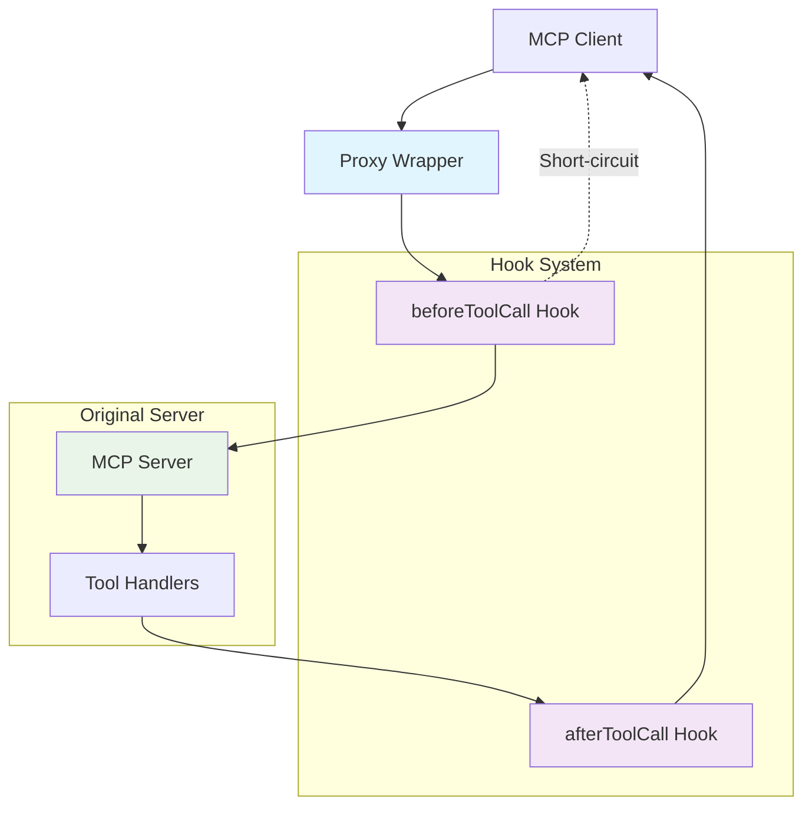

# MCP Proxy Wrapper

A lightweight, powerful wrapper for Model Context Protocol (MCP) servers that provides a comprehensive hook system for intercepting, monitoring, and modifying tool calls without changing your existing server code.

[](https://www.npmjs.com/package/mcp-proxy-wrapper)
[](https://opensource.org/licenses/MIT)
[](https://www.typescriptlang.org/)

## 🚀 Why MCP Proxy Wrapper?

The Model Context Protocol is revolutionizing how AI systems interact with external tools and data sources. However, production deployments often need additional capabilities like monitoring, authentication, caching, and error handling. The MCP Proxy Wrapper provides these capabilities without requiring you to modify your existing MCP server code.

### Key Benefits

- **🔧 Zero Code Changes**: Wrap any existing MCP server without modifications
- **🪝 Powerful Hooks**: Execute custom logic before and after every tool call
- **📊 Production Ready**: Built-in logging, error handling, and monitoring
- **🧪 Thoroughly Tested**: 100% test coverage with real MCP protocol validation
- **🚀 High Performance**: Minimal overhead with efficient proxy implementation

## 🎯 Quick Start

Get up and running in under 5 minutes:

```typescript
import { McpServer } from '@modelcontextprotocol/sdk/server/mcp.js';
import { wrapWithProxy } from 'mcp-proxy-wrapper';

// Your existing MCP server
const server = new McpServer({ name: 'My Server', version: '1.0.0' });

// Add proxy capabilities
const proxiedServer = wrapWithProxy(server, {
  hooks: {
    beforeToolCall: async (context) => {
      console.log(`🔧 Tool called: ${context.toolName}`);
    }
  }
});

// Use exactly like your original server
proxiedServer.tool('greet', { name: 'string' }, async (args) => {
  return { content: [{ type: 'text', text: `Hello, ${args.name}!` }] };
});
```

## 🏗️ Architecture

The MCP Proxy Wrapper uses a sophisticated proxy-based architecture that intercepts method calls to your MCP server and injects custom functionality through a flexible hook system.



### Flow Breakdown

1. **Client Request**: MCP client makes a tool call
2. **Proxy Interception**: Proxy wrapper intercepts the call
3. **Before Hook**: Execute custom logic, modify arguments, or short-circuit
4. **Tool Execution**: Call the original tool handler (if not short-circuited)
5. **After Hook**: Process results, add metadata, handle errors
6. **Response**: Return processed result to client

## 🛠️ Core Use Cases

### Authentication & Authorization

```typescript
const authProxy = wrapWithProxy(server, {
  hooks: {
    beforeToolCall: async (context) => {
      // Validate API key
      if (!await validateApiKey(context.args.apiKey)) {
        return {
          result: {
            content: [{ type: 'text', text: 'Authentication failed' }],
            isError: true
          }
        };
      }
      
      // Check permissions
      if (!await hasPermission(context.args.userId, context.toolName)) {
        return {
          result: {
            content: [{ type: 'text', text: 'Access denied' }],
            isError: true
          }
        };
      }
    }
  }
});
```

### Rate Limiting & Quotas

```typescript
const rateLimitedProxy = wrapWithProxy(server, {
  hooks: {
    beforeToolCall: async (context) => {
      const userId = context.args.userId;
      const quota = await getQuota(userId);
      
      if (quota.remaining <= 0) {
        return {
          result: {
            content: [{ 
              type: 'text', 
              text: `Quota exceeded. Resets at ${quota.resetTime}` 
            }],
            isError: true
          }
        };
      }
      
      await decrementQuota(userId);
    }
  }
});
```

### Caching & Performance

```typescript
const cachedProxy = wrapWithProxy(server, {
  hooks: {
    beforeToolCall: async (context) => {
      const cacheKey = getCacheKey(context.toolName, context.args);
      const cached = await cache.get(cacheKey);
      
      if (cached && !cached.expired) {
        return { result: cached.data };
      }
    },
    afterToolCall: async (context, result) => {
      if (!result.result.isError) {
        const cacheKey = getCacheKey(context.toolName, context.args);
        await cache.set(cacheKey, result.result, { ttl: 300 });
      }
      return result;
    }
  }
});
```

### Monitoring & Analytics

```typescript
const monitoredProxy = wrapWithProxy(server, {
  hooks: {
    beforeToolCall: async (context) => {
      // Start timing
      context.startTime = performance.now();
      
      // Log request
      await analytics.track('tool_call_started', {
        tool: context.toolName,
        userId: context.args.userId,
        timestamp: Date.now()
      });
    },
    afterToolCall: async (context, result) => {
      const duration = performance.now() - context.startTime;
      
      // Log metrics
      await Promise.all([
        metrics.histogram('tool_call_duration', duration, { 
          tool: context.toolName 
        }),
        metrics.increment('tool_calls_total', { 
          tool: context.toolName,
          status: result.result.isError ? 'error' : 'success'
        })
      ]);
      
      return result;
    }
  }
});
```

## 📚 Advanced Features

### Hook Composition

Combine multiple hooks for complex workflows:

```typescript
const compositeProxy = wrapWithProxy(server, {
  hooks: {
    beforeToolCall: async (context) => {
      // 1. Authentication
      await authenticateUser(context);
      
      // 2. Rate limiting
      await checkRateLimit(context);
      
      // 3. Input validation
      await validateInput(context);
      
      // 4. Add metadata
      context.args.requestId = generateRequestId();
      context.args.timestamp = Date.now();
    },
    afterToolCall: async (context, result) => {
      // 1. Error handling
      if (result.result.isError) {
        await logError(context, result);
      }
      
      // 2. Add response metadata
      result.result._meta = {
        requestId: context.args.requestId,
        processingTime: Date.now() - context.args.timestamp,
        version: '1.0.0'
      };
      
      // 3. Update analytics
      await updateAnalytics(context, result);
      
      return result;
    }
  }
});
```

### Dynamic Hook Behavior

Adapt hook behavior based on context:

```typescript
const dynamicProxy = wrapWithProxy(server, {
  hooks: {
    beforeToolCall: async (context) => {
      // Different behavior per tool
      switch (context.toolName) {
        case 'sensitive-data':
          return await handleSensitiveData(context);
        case 'public-api':
          return await handlePublicApi(context);
        case 'admin-tool':
          return await handleAdminTool(context);
      }
      
      // Default behavior
      await logToolCall(context);
    }
  }
});
```

### Error Recovery

Implement sophisticated error handling:

```typescript
const resilientProxy = wrapWithProxy(server, {
  hooks: {
    afterToolCall: async (context, result) => {
      if (result.result.isError) {
        // Attempt recovery
        const recovered = await attemptRecovery(context, result);
        if (recovered) {
          return { result: recovered };
        }
        
        // Fallback response
        return {
          result: {
            content: [{
              type: 'text',
              text: 'Service temporarily unavailable. Please try again.'
            }],
            isError: false // Convert error to graceful response
          }
        };
      }
      
      return result;
    }
  }
});
```

## 🔧 Configuration

### Environment-Based Configuration

```typescript
const config = {
  debug: process.env.NODE_ENV === 'development',
  hooks: {
    beforeToolCall: async (context) => {
      if (process.env.ENABLE_AUTH === 'true') {
        await authenticate(context);
      }
      
      if (process.env.ENABLE_RATE_LIMITING === 'true') {
        await checkRateLimit(context);
      }
    }
  }
};

const proxy = wrapWithProxy(server, config);
```

### Feature Flags

```typescript
const featureFlags = await getFeatureFlags(userId);

const proxy = wrapWithProxy(server, {
  hooks: {
    beforeToolCall: async (context) => {
      if (featureFlags.enableNewFeature) {
        context.args.useNewAlgorithm = true;
      }
      
      if (featureFlags.enableDetailedLogging) {
        await detailedLog(context);
      }
    }
  }
});
```

## 🚀 Getting Started

Ready to get started? Check out our guides:

- [Quick Start Guide](./quickstart) - Get up and running in 5 minutes
- [API Reference](./api) - Complete API documentation
- [Examples](./examples) - Real-world examples and patterns
- [Getting Started](./getting-started) - Comprehensive tutorial

## 🤝 Community & Support

- **GitHub**: [Issues](https://github.com/your-username/mcp-proxy-wrapper/issues) | [Discussions](https://github.com/your-username/mcp-proxy-wrapper/discussions)
- **Discord**: [MCP Community](https://discord.gg/mcp-community)
- **Documentation**: [Full Documentation](https://your-username.github.io/mcp-proxy-wrapper/)

---

<div align="center">
  <strong>Built with ❤️ for the MCP ecosystem</strong><br>
  <em>Empowering developers to build production-ready MCP servers</em>
</div>