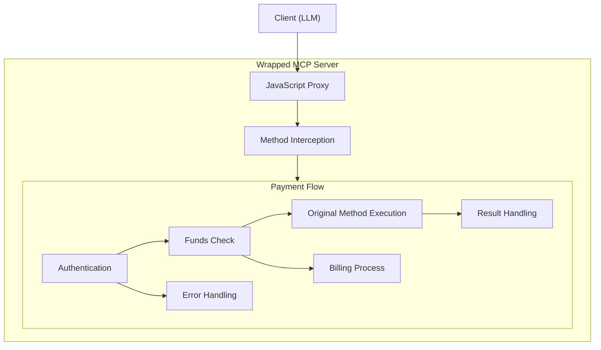

# MCP Payment Wrapper

A payment wrapper for Model Context Protocol (MCP) servers that adds payment verification and billing functionality.

## Overview

The MCP Payment Wrapper adds payment functionality to an existing MCP server. It validates API keys, user JWT tokens, and manages billing checks without modifying the original server code.

## Features

1. **Instance Wrapping:**  
   - Accepts an instance of an existing MCP server.
   - Uses JavaScript Proxy to intercept method calls without modifying the original server.
  
2. **Developer API Key Verification:**  
   - Validates that a valid developer API key is provided as part of the options.
   - Currently uses a mock implementation for verification.

3. **User JWT Verification:**  
   - Accepts user JWT tokens for authentication.
   - Currently uses a mock service that simulates JWT verification.
   - Real JWT verification would require integration with an authentication backend.

4. **Billing Check:**  
   - Before forwarding the MCP call, performs a billing check.
   - Currently simulates the check using random success/failure or test overrides.
   - Real implementation would require integration with a billing service.

5. **Call Forwarding:**  
   - If the billing check passes, forwards the call to the underlying MCP server.
  
6. **Billing Transaction:**  
   - After the MCP call succeeds, logs a billing transaction.
   - Currently simulates processing a transaction without actual payment processing.
   - Real implementation would require integration with payment providers.
  
7. **Error Handling and Logging:**  
   - If any step fails, returns an appropriate error response.
   - Logs errors and important events using a Winston-based logger.

8. **Payment Authentication Tools:**  
   - Provides tools for user authentication and balance management.
   - Supports a user-friendly authentication flow.
   - Currently uses a mock authentication service for testing.
   - Real implementation would connect to an authentication server.

## Quick Start

Our [Quick Start Guide](./quickstart) will help you get up and running with MCP Payment Wrapper in just a few minutes.

## System Architecture

The MCP Payment Wrapper uses a proxy-based architecture to intercept calls to the MCP server and add payment verification functionality without modifying the original server code.

## API Documentation

For detailed API documentation, please visit the [API Reference](./api/reference) section.

## Examples

See the [Examples](./examples) section for code samples and usage scenarios.

## Contributing

Contributions are welcome! Please feel free to submit a Pull Request.

## License

This project is licensed under the MIT License - see the [LICENSE](https://github.com/crazyrabbitltc/mcp-payment-wrapper/blob/main/LICENSE) file for details.
