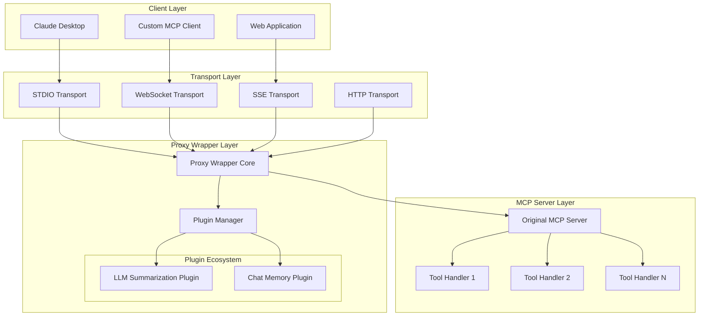
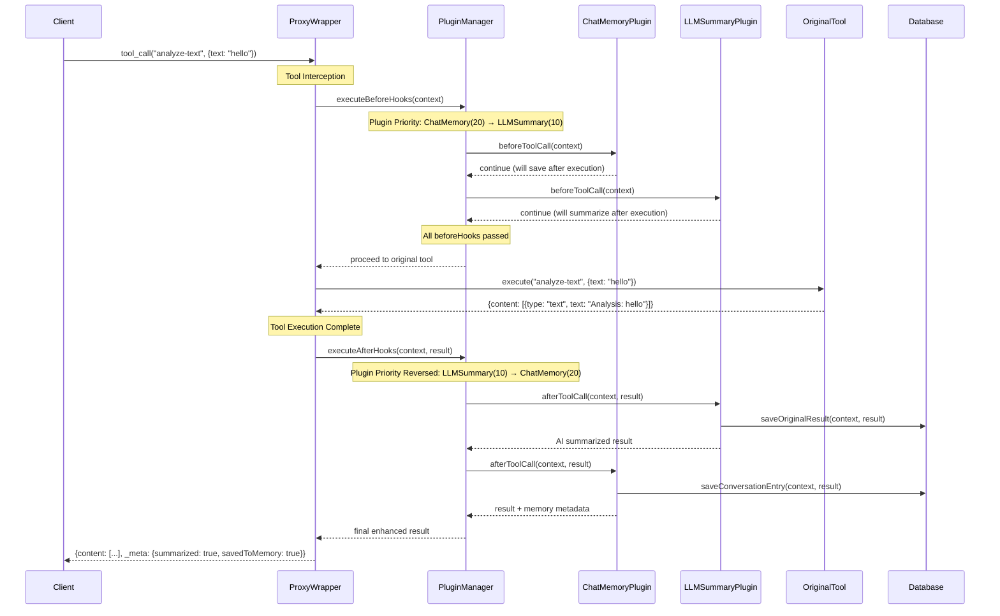
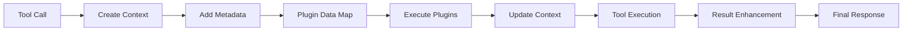

import { Callout, Tabs, Tab } from 'nextra/components'

# Architecture

Technical architecture, design patterns, and internal mechanisms of the MCP Proxy Wrapper.

## System Architecture Overview

The system consists of four distinct layers that work together to provide enhanced MCP functionality. Each layer has specific responsibilities and can be modified independently.



The architecture is designed with clear separation of concerns:
- Client Layer: Various MCP clients that consume tools
- Transport Layer: Communication protocols (STDIO, WebSocket, SSE, HTTP)
- Proxy Wrapper Layer: Interception and plugin coordination
- MCP Server Layer: Your original, unmodified server and tools

## Plugin Execution Swimlane

The following swimlane diagram shows the detailed step-by-step process when a tool call is made. This illustrates how plugins interact with each other and with external systems like databases during request processing.



## Core Components

### 1. Proxy Wrapper Core

The central orchestration component that:

<Tabs items={['Responsibilities', 'Key Methods', 'Error Handling']}>
  <Tab>
    - **Tool Interception**: Replaces `server.tool()` method with enhanced version
    - **Plugin Coordination**: Manages plugin lifecycle and execution order
    - **Context Management**: Creates and maintains request context across plugins
    - **Transport Abstraction**: Works with all MCP transport protocols
    - **Error Isolation**: Prevents plugin failures from breaking tool execution
  </Tab>
  <Tab>
    ```typescript
    class ProxyWrapper {
      // Main wrapping method
      static async wrapWithProxy(
        server: McpServer, 
        options: ProxyWrapperOptions
      ): Promise<WrappedServer>
      
      // Plugin management
      private registerPlugin(plugin: ProxyPlugin): void
      private initializePlugins(): Promise<void>
      
      // Tool interception
      private enhanceToolMethod(originalMethod: Function): Function
      private createEnhancedHandler(originalHandler: Function): Function
      
      // Execution coordination
      private executeBeforeHooks(context: ToolCallContext): Promise<ToolCallResult | void>
      private executeAfterHooks(context: ToolCallContext, result: ToolCallResult): Promise<ToolCallResult>
    }
    ```
  </Tab>
  <Tab>
    - **Plugin Error Isolation**: Plugin failures don't break tool execution
    - **Timeout Management**: Configurable timeouts for plugin execution
    - **Graceful Degradation**: Core functionality continues even if plugins fail
    - **Detailed Logging**: Comprehensive error reporting and debugging information
    - **Recovery Mechanisms**: Automatic retry and fallback strategies
  </Tab>
</Tabs>

### 2. Plugin Manager

Handles plugin lifecycle, priority ordering, and execution:

```typescript
interface PluginManager {
  // Plugin registration and lifecycle
  register(plugin: ProxyPlugin, config?: PluginConfig): Promise<void>
  initialize(): Promise<void>
  destroy(): Promise<void>
  
  // Execution methods
  executeBeforeHooks(context: ToolCallContext): Promise<ToolCallResult | void>
  executeAfterHooks(context: ToolCallContext, result: ToolCallResult): Promise<ToolCallResult>
  
  // Management methods
  getExecutionOrder(): ProxyPlugin[]
  validateDependencies(): Promise<boolean>
  healthCheck(): Promise<Map<string, boolean>>
}
```

### 3. Plugin Architecture

Plugins follow a standard interface pattern:

```typescript
interface ProxyPlugin {
  // Identity
  readonly name: string
  readonly version: string
  readonly metadata?: PluginMetadata
  
  // Configuration
  config?: PluginConfig
  
  // Lifecycle hooks
  initialize?(context: PluginInitContext): Promise<void>
  beforeToolCall?(context: PluginContext): Promise<void | ToolCallResult>
  afterToolCall?(context: PluginContext, result: ToolCallResult): Promise<ToolCallResult>
  onError?(error: PluginError): Promise<void | ToolCallResult>
  destroy?(): Promise<void>
  
  // Health and stats
  healthCheck?(): Promise<boolean>
  getStats?(): Promise<PluginStats>
}
```

## Design Patterns

### 1. Decorator Pattern

The proxy wrapper uses the **Decorator Pattern** to enhance MCP servers:

```typescript
// Original server
const server = new McpServer({ name: 'my-server', version: '1.0.0' });

// Decorated server with enhanced capabilities
const decoratedServer = await wrapWithProxy(server, {
  plugins: [memoryPlugin, summaryPlugin]
});
```

### 2. Chain of Responsibility

Plugins execute in a **Chain of Responsibility** pattern:

```typescript
class PluginChain {
  async executeBeforeHooks(context: ToolCallContext): Promise<ToolCallResult | void> {
    for (const plugin of this.sortedPlugins) {
      const result = await plugin.beforeToolCall?.(context);
      if (result) {
        return result; // Chain terminated early
      }
    }
    // Chain completed successfully
  }
}
```

### 3. Strategy Pattern

Different rate limiting strategies use the **Strategy Pattern**:

```typescript
interface RateLimitStrategy {
  checkLimit(userId: string, toolName: string): Promise<boolean>
  updateUsage(userId: string, toolName: string): Promise<void>
}

class FixedWindowLimiting implements RateLimitStrategy { /* ... */ }
class SlidingWindowLimiting implements RateLimitStrategy { /* ... */ }
class TokenBucketLimiting implements RateLimitStrategy { /* ... */ }
```

### 4. Observer Pattern

Analytics and monitoring use the **Observer Pattern**:

```typescript
class EventEmitter {
  emit(event: string, data: any): void
  
  // Plugin events
  'tool:before': (context: ToolCallContext) => void
  'tool:after': (context: ToolCallContext, result: ToolCallResult) => void
  'plugin:error': (error: PluginError) => void
  'rateLimit:exceeded': (limitInfo: RateLimitInfo) => void
}
```

## Data Flow Architecture

### Request Context Flow



### Plugin Data Sharing

Plugins can share data through the context:

```typescript
interface PluginContext extends ToolCallContext {
  pluginData: Map<string, any>        // Shared plugin data
  previousResults?: Map<string, any>  // Results from previous plugins
}

// Memory plugin sets conversation data
context.pluginData.set('memory:sessionId', 'session_123');

// Summarization plugin reads conversation context
const sessionId = context.pluginData.get('memory:sessionId');
const shouldSummarize = context.toolName === 'research' && content.length > 500;
```

## Performance Architecture

### Optimization Strategies

<Callout type="info" emoji="⚡">
  The proxy wrapper is designed for **minimal overhead** with several optimization strategies:
</Callout>

1. **Lazy Loading**: Plugins only initialize when first used
2. **Async Execution**: Non-blocking plugin execution with Promise.all where possible
3. **Priority Ordering**: Critical plugins (auth) run first to fail fast
4. **Result Caching**: Plugin results cached to avoid repeated expensive operations
5. **Memory Pooling**: Context objects reused to reduce garbage collection

### Scalability Considerations

- **Stateless Design**: Plugins maintain no server-side state
- **Database Connections**: Connection pooling for high-traffic scenarios
- **Caching Layers**: Redis/Memcached support for distributed caching
- **Load Balancing**: Multiple proxy wrapper instances can run in parallel
- **Horizontal Scaling**: Database-backed plugins support clustering

## Security Architecture

### Security Layers

1. **Memory Layer**: Store and retrieve conversation history
2. **AI Enhancement Layer**: Provide summarization and processing
3. **Input Validation**: Sanitize and validate all inputs
4. **Context Management**: Maintain session and user context
5. **Response Processing**: Transform and enhance tool outputs
6. **Data Storage**: Secure storage of conversation data

### Threat Model

The proxy wrapper provides:

- **Data Privacy**: Secure storage and handling of conversation data
- **Memory Management**: Controlled storage with cleanup and limits
- **AI Safety**: Secure integration with external AI providers
- **Content Filtering**: Validation of AI-generated content
- **Error Isolation**: Plugin failures don't break core functionality
- **Resource Management**: Memory and storage limits

<Callout type="warning">
  **Security Best Practices**: Always use HTTPS in production, rotate API keys regularly, and implement proper access controls.
</Callout>

## Extension Points

The architecture provides several extension points for customization:

1. **Custom Plugins**: Implement the `ProxyPlugin` interface
2. **Custom Transports**: Extend transport layer compatibility
3. **Custom Authentication**: Implement `AuthenticationProvider` interface  
4. **Custom Analytics**: Implement custom analytics tracking
5. **Custom Storage**: Implement `DatabaseAdapter` interface

Next: Explore the [Plugin System](/plugins) and available plugins.