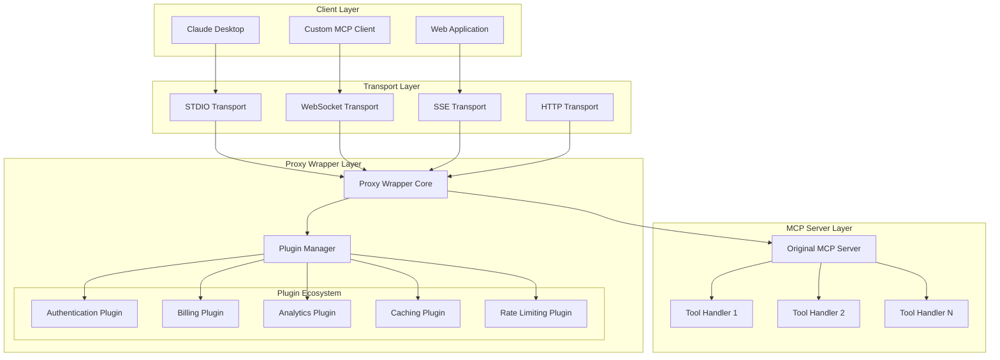
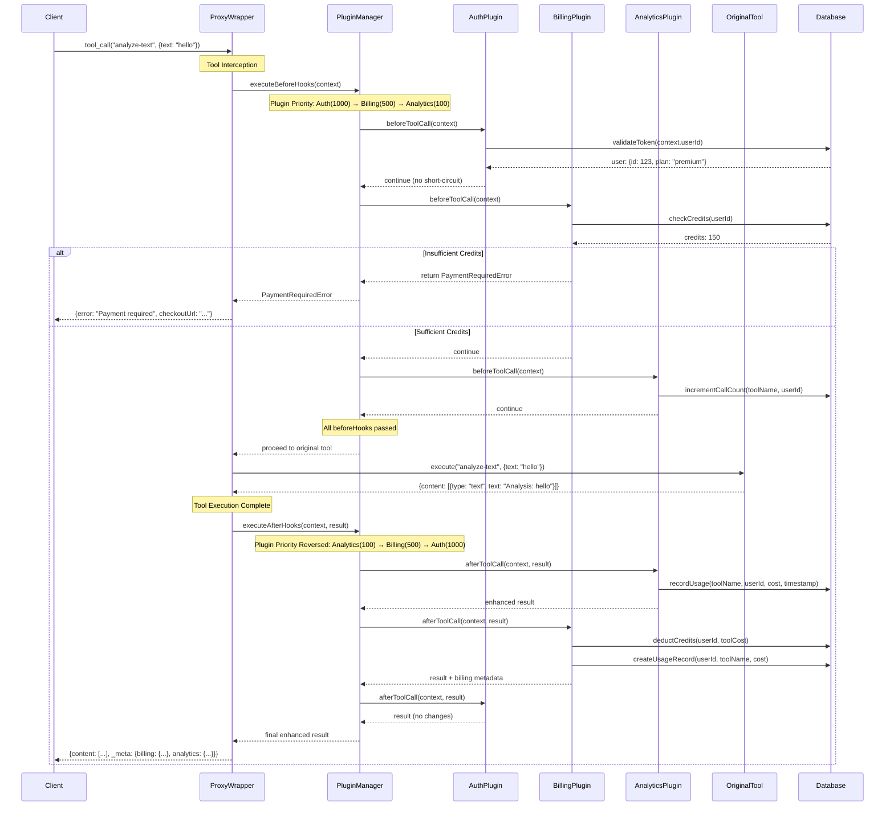
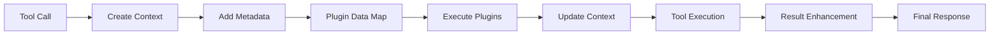

import { Callout, Tabs, Tab } from 'nextra/components'

# Architecture

Deep dive into the technical architecture, design patterns, and internal mechanisms of the MCP Proxy Wrapper.

## System Architecture Overview



## Plugin Execution Swimlane

This swimlane diagram shows the detailed step-by-step process when a tool call is made:



## Core Components

### 1. Proxy Wrapper Core

The central orchestration component that:

<Tabs items={['Responsibilities', 'Key Methods', 'Error Handling']}>
  <Tab>
    - **Tool Interception**: Replaces `server.tool()` method with enhanced version
    - **Plugin Coordination**: Manages plugin lifecycle and execution order
    - **Context Management**: Creates and maintains request context across plugins
    - **Transport Abstraction**: Works with all MCP transport protocols
    - **Error Isolation**: Prevents plugin failures from breaking tool execution
  </Tab>
  <Tab>
    ```typescript
    class ProxyWrapper {
      // Main wrapping method
      static async wrapWithProxy(
        server: McpServer, 
        options: ProxyWrapperOptions
      ): Promise<WrappedServer>
      
      // Plugin management
      private registerPlugin(plugin: ProxyPlugin): void
      private initializePlugins(): Promise<void>
      
      // Tool interception
      private enhanceToolMethod(originalMethod: Function): Function
      private createEnhancedHandler(originalHandler: Function): Function
      
      // Execution coordination
      private executeBeforeHooks(context: ToolCallContext): Promise<ToolCallResult | void>
      private executeAfterHooks(context: ToolCallContext, result: ToolCallResult): Promise<ToolCallResult>
    }
    ```
  </Tab>
  <Tab>
    - **Plugin Error Isolation**: Plugin failures don't break tool execution
    - **Timeout Management**: Configurable timeouts for plugin execution
    - **Graceful Degradation**: Core functionality continues even if plugins fail
    - **Detailed Logging**: Comprehensive error reporting and debugging information
    - **Recovery Mechanisms**: Automatic retry and fallback strategies
  </Tab>
</Tabs>

### 2. Plugin Manager

Handles plugin lifecycle, priority ordering, and execution:

```typescript
interface PluginManager {
  // Plugin registration and lifecycle
  register(plugin: ProxyPlugin, config?: PluginConfig): Promise<void>
  initialize(): Promise<void>
  destroy(): Promise<void>
  
  // Execution methods
  executeBeforeHooks(context: ToolCallContext): Promise<ToolCallResult | void>
  executeAfterHooks(context: ToolCallContext, result: ToolCallResult): Promise<ToolCallResult>
  
  // Management methods
  getExecutionOrder(): ProxyPlugin[]
  validateDependencies(): Promise<boolean>
  healthCheck(): Promise<Map<string, boolean>>
}
```

### 3. Plugin Architecture

Plugins follow a standard interface pattern:

```typescript
interface ProxyPlugin {
  // Identity
  readonly name: string
  readonly version: string
  readonly metadata?: PluginMetadata
  
  // Configuration
  config?: PluginConfig
  
  // Lifecycle hooks
  initialize?(context: PluginInitContext): Promise<void>
  beforeToolCall?(context: PluginContext): Promise<void | ToolCallResult>
  afterToolCall?(context: PluginContext, result: ToolCallResult): Promise<ToolCallResult>
  onError?(error: PluginError): Promise<void | ToolCallResult>
  destroy?(): Promise<void>
  
  // Health and stats
  healthCheck?(): Promise<boolean>
  getStats?(): Promise<PluginStats>
}
```

## Design Patterns

### 1. Decorator Pattern

The proxy wrapper uses the **Decorator Pattern** to enhance MCP servers:

```typescript
// Original server
const server = new McpServer(config);

// Decorated server with enhanced capabilities
const decoratedServer = await wrapWithProxy(server, {
  plugins: [authPlugin, billingPlugin, analyticsPlugin]
});
```

### 2. Chain of Responsibility

Plugins execute in a **Chain of Responsibility** pattern:

```typescript
class PluginChain {
  async executeBeforeHooks(context: ToolCallContext): Promise<ToolCallResult | void> {
    for (const plugin of this.sortedPlugins) {
      const result = await plugin.beforeToolCall?.(context);
      if (result) {
        return result; // Chain terminated early
      }
    }
    // Chain completed successfully
  }
}
```

### 3. Strategy Pattern

Different billing models use the **Strategy Pattern**:

```typescript
interface BillingStrategy {
  calculateCost(toolName: string, args: any): Promise<number>
  processPayment(customerId: string, amount: number): Promise<PaymentResult>
}

class PerCallBilling implements BillingStrategy { /* ... */ }
class SubscriptionBilling implements BillingStrategy { /* ... */ }
class CreditsBilling implements BillingStrategy { /* ... */ }
```

### 4. Observer Pattern

Analytics and monitoring use the **Observer Pattern**:

```typescript
class EventEmitter {
  emit(event: string, data: any): void
  
  // Plugin events
  'tool:before': (context: ToolCallContext) => void
  'tool:after': (context: ToolCallContext, result: ToolCallResult) => void
  'plugin:error': (error: PluginError) => void
  'payment:success': (payment: PaymentInfo) => void
}
```

## Data Flow Architecture

### Request Context Flow



### Plugin Data Sharing

Plugins can share data through the context:

```typescript
interface PluginContext extends ToolCallContext {
  pluginData: Map<string, any>        // Shared plugin data
  previousResults?: Map<string, any>  // Results from previous plugins
}

// Plugin A sets data
context.pluginData.set('auth:userId', '12345');

// Plugin B reads data
const userId = context.pluginData.get('auth:userId');
```

## Performance Architecture

### Optimization Strategies

<Callout type="info" emoji="⚡">
  The proxy wrapper is designed for **minimal overhead** with several optimization strategies:
</Callout>

1. **Lazy Loading**: Plugins only initialize when first used
2. **Async Execution**: Non-blocking plugin execution with Promise.all where possible
3. **Priority Ordering**: Critical plugins (auth) run first to fail fast
4. **Result Caching**: Plugin results cached to avoid repeated expensive operations
5. **Memory Pooling**: Context objects reused to reduce garbage collection

### Scalability Considerations

- **Stateless Design**: Plugins maintain no server-side state
- **Database Connections**: Connection pooling for high-traffic scenarios
- **Caching Layers**: Redis/Memcached support for distributed caching
- **Load Balancing**: Multiple proxy wrapper instances can run in parallel
- **Horizontal Scaling**: Database-backed plugins support clustering

## Security Architecture

### Security Layers

1. **Authentication Layer**: Verify user identity
2. **Authorization Layer**: Check tool access permissions
3. **Input Validation**: Sanitize and validate all inputs
4. **Rate Limiting**: Prevent abuse and DoS attacks
5. **Audit Logging**: Track all tool calls and admin actions
6. **Encryption**: Encrypt sensitive data at rest and in transit

### Threat Model

The proxy wrapper protects against:

- **Unauthorized Access**: Authentication and authorization plugins
- **Usage Abuse**: Rate limiting and billing controls
- **Data Injection**: Input validation and sanitization
- **DoS Attacks**: Request throttling and circuit breakers
- **Payment Fraud**: Stripe's built-in fraud protection
- **Data Breaches**: Encryption and access controls

<Callout type="warning">
  **Security Best Practices**: Always use HTTPS in production, rotate API keys regularly, and implement proper access controls.
</Callout>

## Extension Points

The architecture provides several extension points for customization:

1. **Custom Plugins**: Implement the `ProxyPlugin` interface
2. **Custom Transports**: Extend transport layer compatibility
3. **Custom Authentication**: Implement `AuthenticationProvider` interface  
4. **Custom Billing**: Implement `BillingProvider` interface
5. **Custom Storage**: Implement `DatabaseAdapter` interface

Next: Explore the [Plugin System](/plugins) and available plugins.