import { Callout, Steps } from 'nextra/components'

# How It Works

The MCP Proxy Wrapper acts as an invisible enhancement layer that sits between MCP clients and your existing server. It intercepts tool calls, adds powerful features through plugins and hooks, then forwards everything to your original server code—all without requiring any changes to your existing implementation.

## 🔍 The Magic: Zero-Code Enhancement

**The Problem**: You have a working MCP server but need to add authentication, logging, AI summarization, or monitoring. Traditional approaches require modifying your server code, adding dependencies, and maintaining complex integrations.

**The Solution**: The proxy wrapper intercepts your server's tool registration process and transparently enhances each tool with plugin functionality, while preserving your original code completely unchanged.

```typescript
// Your existing server stays exactly the same
const server = new McpServer({ name: 'My Server', version: '1.0.0' });
server.tool('getData', schema, originalHandler); // ← NO CHANGES TO THIS

// The proxy wrapper creates an enhanced version
const enhancedServer = await wrapWithProxy(server, {
  plugins: [new LLMSummarizationPlugin()]
});

// Now your tools have AI summarization without code changes!
```

## 🔧 Core Mechanism

Instead of modifying your server code, the proxy wrapper works by **intercepting the tool registration process** and creating an enhanced wrapper around each tool handler.

### 📊 Request Flow: Your Tools, Enhanced

Here's exactly what happens when a client calls your tool:

```mermaid
graph TD
    A[MCP Client] -->|"getData(query: 'AI trends')"| B[Proxy Wrapper]
    B --> C{beforeToolCall Hooks}
    C --> D[🔐 Authentication Plugin]
    D --> E[📊 Logging Plugin]
    E --> F[✅ Validation Passed]
    F --> G[Your Original Tool Handler]
    G -->|"Long response about AI..."| H{afterToolCall Hooks}
    H --> I[🤖 LLM Summarization Plugin]
    I --> J[💾 Memory Plugin]
    J --> K[Enhanced Response]
    K -->|"Summarized response + metadata"| A
```



**🔄 Step-by-Step Breakdown:**

1. **Client Request**: `getData({ query: 'AI trends' })`
2. **Proxy Intercepts**: Captures the request before your tool sees it
3. **Before Hooks Execute**: 
   - 🔐 Authentication check (if configured)
   - 📊 Request logging starts
   - ✅ Input validation and sanitization
4. **Your Tool Executes**: Your original `getData` handler runs unchanged
5. **After Hooks Execute**:
   - 🤖 AI summarizes long responses (if > 500 chars)
   - 💾 Saves response to conversation memory
   - 📊 Logs completion time and metadata
6. **Enhanced Response**: Client gets summarized content + metadata

**✨ Your original tool code never changes, but gains enterprise features!**

## Plugin Execution Flow

The proxy wrapper executes plugins in a priority-ordered sequence with two main phases:

### Phase 1: beforeToolCall
- Memory Plugin: Check if response should be saved
- LLM Summarization: Check if response should be summarized
- Request Processing: Prepare context for tool execution

### Phase 2: afterToolCall
- Memory Plugin: Save tool responses to memory database
- LLM Summarization: Generate AI summaries of long responses
- Response Enhancement: Add metadata about processing

<Callout type="info">
  Short-Circuit Capability: Any beforeToolCall hook can return a result to immediately respond without executing the original tool.
</Callout>

## Tool Interception Process

The proxy wrapper modifies your MCP server through a three-step process:

<Steps>
### Server Wrapping
When you call `wrapWithProxy(server, options)`, the wrapper:
- Stores a reference to the original `server.tool()` method
- Replaces it with an enhanced version that includes plugin hooks
- Initializes all registered plugins in priority order

### Tool Registration Enhancement
When you call `proxiedServer.tool(name, schema, handler)`:
- The original tool schema and handler are preserved
- A new enhanced handler is created that wraps the original
- Plugin hooks are injected before and after the original handler

### Runtime Execution
When a tool call arrives:
- Context is created with tool name, arguments, and metadata
- beforeToolCall hooks execute in priority order (highest first)
- If no hook short-circuits, the original tool handler executes
- afterToolCall hooks execute in reverse priority order (lowest first)
- The final result is returned to the client
</Steps>

## Tool Registration Behavior

<Callout type="info">
**Important:** The proxy wrapper only enhances tools registered AFTER wrapping. Tools registered before wrapping remain available but don't get hook/plugin functionality.
</Callout>

### What Gets Enhanced

```typescript
const server = new McpServer({ name: 'My Tools', version: '1.0.0' });

// ❌ This tool won't have plugin functionality
server.tool('old-tool', { text: z.string() }, async (args) => {
  return { content: [{ type: 'text', text: 'Old tool response' }] };
});

// Wrap the server
const proxiedServer = await wrapWithProxy(server, { plugins: [authPlugin] });

// ✅ This tool will have full plugin functionality
proxiedServer.tool('new-tool', { text: z.string() }, async (args) => {
  return { content: [{ type: 'text', text: 'Enhanced tool response' }] };
});

// Both tools are available to clients, but only 'new-tool' gets:
// - Authentication checks
// - Summarization functionality
// - Analytics tracking
// - Custom hook execution
```

### All Server Functionality Preserved

The proxy wrapper preserves all existing MCP server functionality:
- Existing tools remain fully functional
- Resource providers work unchanged
- Prompt templates are unaffected  
- Server metadata and capabilities are preserved
- Transport layer (STDIO, WebSocket, etc.) works identically

## 🛠️ Behind the Scenes: What Actually Happens

When you call `wrapWithProxy()`, here's the magic that happens under the hood:

### Your Original Code (Unchanged)
```typescript
const server = new McpServer({ name: 'My Tools', version: '1.0.0' });

// Your existing tool - NO CHANGES REQUIRED
server.tool('analyze-text', { 
  text: z.string(),
  userId: z.string().optional() 
}, async (args) => {
  const result = await performAnalysis(args.text);
  return { content: [{ type: 'text', text: result }] };
});
```

### What the Proxy Wrapper Creates Internally
```typescript
// The proxy wrapper intercepts tool registration
const originalToolMethod = server.tool.bind(server);

server.tool = function(name: string, schema: any, originalHandler: Function) {
  
  // Create an enhanced wrapper around your original handler
  const enhancedHandler = async (args: any) => {
    const context = {
      toolName: name,
      args,
      metadata: { 
        requestId: generateId(), 
        timestamp: Date.now(),
        userId: args.userId 
      }
    };
    
    // PHASE 1: Execute beforeToolCall hooks
    console.log(`🔧 [${new Date().toISOString()}] Starting: ${name}`);
    
    for (const plugin of plugins) {
      const result = await plugin.beforeToolCall?.(context);
      if (result) {
        // Plugin can short-circuit (e.g., return cached result)
        console.log(`⚡ Short-circuited by: ${plugin.name}`);
        return result;
      }
    }
    
    // PHASE 2: Execute your original tool (UNCHANGED)
    console.log(`▶️ Executing original handler for: ${name}`);
    const originalResult = await originalHandler(args);
    
    // PHASE 3: Execute afterToolCall hooks
    let enhancedResult = originalResult;
    
    for (const plugin of plugins) {
      if (plugin.afterToolCall) {
        enhancedResult = await plugin.afterToolCall(context, enhancedResult);
        console.log(`🔄 Enhanced by: ${plugin.name}`);
      }
    }
    
    console.log(`✅ [${new Date().toISOString()}] Completed: ${name}`);
    return enhancedResult;
  };
  
  // Register the enhanced handler with the original MCP server
  return originalToolMethod(name, schema, enhancedHandler);
};
```

### The Result: Enhanced Without Changes

```typescript
// When a client calls your tool:
const result = await client.callTool({
  name: 'analyze-text',
  arguments: { text: 'This is a long document...', userId: 'user123' }
});

// Your original tool logic executes unchanged, but now:
console.log(result._meta);
// {
//   summarized: true,           // ← Added by LLM plugin
//   originalLength: 1200,       // ← Added by LLM plugin  
//   summaryLength: 150,         // ← Added by LLM plugin
//   savedToMemory: true,        // ← Added by Memory plugin
//   processedAt: "2024-01-15T...", // ← Added by proxy
//   requestId: "req_123"        // ← Added by proxy
// }
```

**🎯 Key Insight**: Your original tool handler runs exactly as written, but the proxy wrapper adds a powerful enhancement layer around it without requiring any code changes.

## Transport Compatibility

The proxy wrapper works with all MCP transport methods because it operates at the tool handler level, not the transport level:

- STDIO: Command-line MCP servers
- WebSocket: Real-time web applications  
- SSE: Server-sent events for streaming
- HTTP: REST API style interactions
- InMemory: Testing and development

## Plugin Context Data

Each plugin receives rich context information:

```typescript
interface ToolCallContext {
  toolName: string;           // Name of the tool being called
  args: Record<string, any>;  // Tool arguments from client
  metadata: {
    requestId: string;        // Unique request identifier
    timestamp: number;        // Request timestamp
    userId?: string;          // Authenticated user ID
    sessionId?: string;       // Session identifier
    transport: string;        // Transport method used
  };
}
```

This context flows through all plugin hooks, allowing for sophisticated cross-plugin coordination and data sharing.

## Error Handling

The proxy wrapper includes robust error handling:

- Plugin Errors: Isolated and logged without breaking tool execution
- Tool Errors: Proper MCP error responses with `isError: true`
- Transport Errors: Graceful degradation and retry logic
- Timeout Handling: Configurable timeouts for plugin execution

<Callout type="warning">
  Plugin Isolation: Plugin errors never break your original tool functionality. If a plugin fails, the tool call continues normally.
</Callout>

## Performance Considerations

The proxy wrapper is designed for minimal overhead:

- Lazy Loading: Plugins only load when needed
- Async Execution: Non-blocking plugin execution
- Caching: Plugin results can be cached to avoid repeated operations
- Priority Ordering: Critical plugins (auth) run first, optional plugins (analytics) run last

Next: Learn about the detailed [Architecture](/architecture) and design patterns.