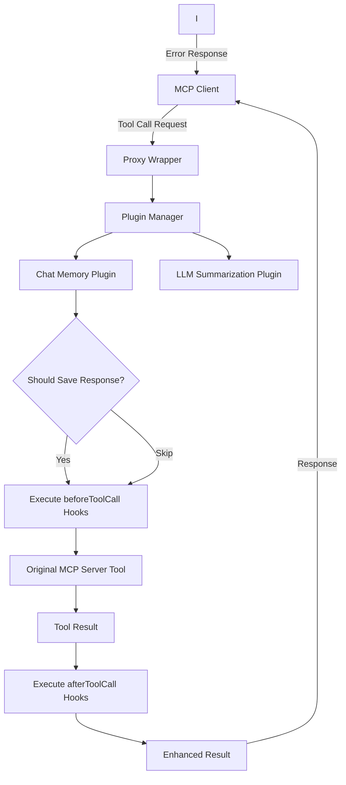

import { Callout, Steps } from 'nextra/components'

# How It Works

The MCP Proxy Wrapper operates as an interception layer between MCP clients and your server, allowing plugins to enhance functionality without modifying your original code.

## Core Mechanism

The proxy wrapper works by intercepting the `server.tool()` method during server initialization and injecting plugin hooks around the original tool handlers.

### High-Level Flow Diagram

The following diagram illustrates how a tool call flows through the proxy wrapper system. When a client makes a request, it first goes through the proxy wrapper, which coordinates with various plugins before reaching your original MCP server.



In this flow:
1. The MCP client sends a tool call request
2. The proxy wrapper receives the request and forwards it to the plugin manager
3. Each plugin (memory, summarization) is consulted in priority order
4. The original tool executes
5. The result flows back through plugins for enhancement (memory storage, AI summarization) before returning to the client

## Plugin Execution Flow

The proxy wrapper executes plugins in a priority-ordered sequence with two main phases:

### Phase 1: beforeToolCall
- Memory Plugin: Check if response should be saved
- LLM Summarization: Check if response should be summarized
- Request Processing: Prepare context for tool execution

### Phase 2: afterToolCall
- Memory Plugin: Save tool responses to memory database
- LLM Summarization: Generate AI summaries of long responses
- Response Enhancement: Add metadata about processing

<Callout type="info">
  Short-Circuit Capability: Any beforeToolCall hook can return a result to immediately respond without executing the original tool.
</Callout>

## Tool Interception Process

The proxy wrapper modifies your MCP server through a three-step process:

<Steps>
### Server Wrapping
When you call `wrapWithProxy(server, options)`, the wrapper:
- Stores a reference to the original `server.tool()` method
- Replaces it with an enhanced version that includes plugin hooks
- Initializes all registered plugins in priority order

### Tool Registration Enhancement
When you call `proxiedServer.tool(name, schema, handler)`:
- The original tool schema and handler are preserved
- A new enhanced handler is created that wraps the original
- Plugin hooks are injected before and after the original handler

### Runtime Execution
When a tool call arrives:
- Context is created with tool name, arguments, and metadata
- beforeToolCall hooks execute in priority order (highest first)
- If no hook short-circuits, the original tool handler executes
- afterToolCall hooks execute in reverse priority order (lowest first)
- The final result is returned to the client
</Steps>

## Tool Registration Behavior

<Callout type="info">
**Important:** The proxy wrapper only enhances tools registered AFTER wrapping. Tools registered before wrapping remain available but don't get hook/plugin functionality.
</Callout>

### What Gets Enhanced

```typescript
const server = new McpServer({ name: 'My Tools', version: '1.0.0' });

// ❌ This tool won't have plugin functionality
server.tool('old-tool', { text: z.string() }, async (args) => {
  return { content: [{ type: 'text', text: 'Old tool response' }] };
});

// Wrap the server
const proxiedServer = await wrapWithProxy(server, { plugins: [authPlugin] });

// ✅ This tool will have full plugin functionality
proxiedServer.tool('new-tool', { text: z.string() }, async (args) => {
  return { content: [{ type: 'text', text: 'Enhanced tool response' }] };
});

// Both tools are available to clients, but only 'new-tool' gets:
// - Authentication checks
// - Summarization functionality
// - Analytics tracking
// - Custom hook execution
```

### All Server Functionality Preserved

The proxy wrapper preserves all existing MCP server functionality:
- Existing tools remain fully functional
- Resource providers work unchanged
- Prompt templates are unaffected  
- Server metadata and capabilities are preserved
- Transport layer (STDIO, WebSocket, etc.) works identically

## Code Example: Behind the Scenes

Here's what happens when you wrap a server:

```typescript
// Original MCP server
const server = new McpServer({ name: 'My Tools', version: '1.0.0' });

// This is what your code looks like
server.tool('analyze-text', { 
  text: z.string(),
  userId: z.string().optional() 
}, async (args) => {
  return { content: [{ type: 'text', text: `Analysis: ${args.text}` }] };
});

// This is what the proxy wrapper actually creates internally
const originalToolMethod = server.tool.bind(server);
server.tool = function(name: string, schema: any, handler: Function) {
  
  // Create enhanced handler with plugin hooks
  const enhancedHandler = async (args: any) => {
    const context = {
      toolName: name,
      args,
      metadata: { requestId: generateId(), timestamp: Date.now() }
    };
    
    // Execute beforeToolCall hooks (memory and summarization checks)
    for (const plugin of sortedPlugins) {
      const result = await plugin.beforeToolCall?.(context);
      if (result) return result; // Short-circuit if plugin returns result
    }
    
    // Execute original handler
    const originalResult = await handler(args);
    
    // Execute afterToolCall hooks (save to memory, generate summaries)
    let finalResult = originalResult;
    for (const plugin of sortedPlugins.reverse()) {
      finalResult = await plugin.afterToolCall?.(context, finalResult) || finalResult;
    }
    
    return finalResult;
  };
  
  // Register with original method using enhanced handler
  return originalToolMethod(name, schema, enhancedHandler);
};
```

## Transport Compatibility

The proxy wrapper works with all MCP transport methods because it operates at the tool handler level, not the transport level:

- STDIO: Command-line MCP servers
- WebSocket: Real-time web applications  
- SSE: Server-sent events for streaming
- HTTP: REST API style interactions
- InMemory: Testing and development

## Plugin Context Data

Each plugin receives rich context information:

```typescript
interface ToolCallContext {
  toolName: string;           // Name of the tool being called
  args: Record<string, any>;  // Tool arguments from client
  metadata: {
    requestId: string;        // Unique request identifier
    timestamp: number;        // Request timestamp
    userId?: string;          // Authenticated user ID
    sessionId?: string;       // Session identifier
    transport: string;        // Transport method used
  };
}
```

This context flows through all plugin hooks, allowing for sophisticated cross-plugin coordination and data sharing.

## Error Handling

The proxy wrapper includes robust error handling:

- Plugin Errors: Isolated and logged without breaking tool execution
- Tool Errors: Proper MCP error responses with `isError: true`
- Transport Errors: Graceful degradation and retry logic
- Timeout Handling: Configurable timeouts for plugin execution

<Callout type="warning">
  Plugin Isolation: Plugin errors never break your original tool functionality. If a plugin fails, the tool call continues normally.
</Callout>

## Performance Considerations

The proxy wrapper is designed for minimal overhead:

- Lazy Loading: Plugins only load when needed
- Async Execution: Non-blocking plugin execution
- Caching: Plugin results can be cached to avoid repeated operations
- Priority Ordering: Critical plugins (auth) run first, optional plugins (analytics) run last

Next: Learn about the detailed [Architecture](/architecture) and design patterns.