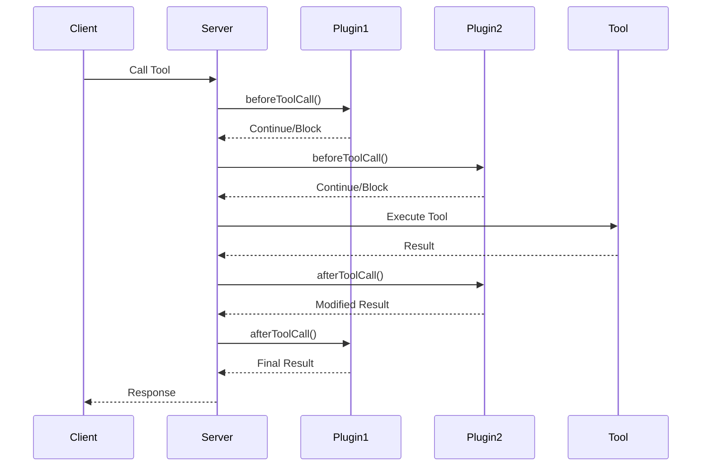

import { Callout, Cards, Card } from 'nextra/components'

# Plugin System

The MCP Proxy Wrapper features a powerful plugin architecture that allows you to extend MCP servers with additional functionality like AI enhancement, analytics, security, and more.

<Callout type="info">
  Plugins operate at the tool call level, intercepting requests before and after execution to add features without modifying your core tool logic.
</Callout>

## How Plugins Work

Plugins implement lifecycle hooks that are called during tool execution:

```typescript
export interface ProxyPlugin {
  name: string;
  version: string;
  
  // Called before tool execution
  beforeToolCall?(context: ToolCallContext): Promise<void | ToolCallResult>;
  
  // Called after tool execution  
  afterToolCall?(context: ToolCallContext, result: ToolCallResult): Promise<ToolCallResult>;
  
  // Plugin lifecycle
  initialize?(context: PluginContext): Promise<void>;
  destroy?(): Promise<void>;
}
```

## Available Plugins

<Cards>
  <Card
    title="Stripe Monetization"
    href="/plugins/stripe-monetization"
  >
    Transform your AI tools into revenue-generating services with enterprise-grade billing, multiple payment models, and Stripe's hosted checkout.
  </Card>
</Cards>

## Planned Plugins

The following plugins are planned for future releases:

- **Analytics & Monitoring**: Track usage patterns, performance metrics, and user behavior
- **Authentication & Security**: JWT authentication, API key management, and authorization controls  
- **Caching & Performance**: Intelligent caching strategies for tool responses and data
- **Rate Limiting**: Configurable rate limiting, burst allowances, and usage quotas
- **Logging & Debugging**: Comprehensive logging with structured output and debugging tools

## Plugin Categories

The plugin system supports several categories of functionality:

### Monetization Plugins
Currently available: Stripe Monetization with support for per-call billing, subscriptions, credits, and freemium models.

### Security & Authentication Plugins  
Planned: JWT authentication, API key management, OAuth integration, and request validation.

### Analytics & Monitoring Plugins
Planned: Usage analytics, performance monitoring, business intelligence, and error tracking.

### Performance & Optimization Plugins
Planned: Response caching, load balancing, circuit breakers, and request compression.

### Utility & Integration Plugins
Planned: Request transformation, data validation, retry logic, and webhook integration.

## Plugin Execution Flow



## Plugin Priorities

Plugins execute in priority order (higher numbers first):

```typescript
const proxiedServer = await wrapWithProxy(server, {
  plugins: [
    { plugin: authPlugin, priority: 1000 },      // Auth first
    { plugin: analyticsPlugin, priority: 500 },  // Analytics 
    { plugin: billingPlugin, priority: 100 }     // Billing last
  ]
});
```

## Quick Start

### 1. Install Plugin Dependencies

```bash
npm install mcp-proxy-wrapper
```

### 2. Import and Configure

```typescript
import { McpServer } from '@modelcontextprotocol/sdk/server/mcp.js';
import { wrapWithProxy, LLMSummarizationPlugin, ChatMemoryPlugin } from 'mcp-proxy-wrapper';

// Configure AI enhancement plugins
const summarizationPlugin = new LLMSummarizationPlugin();
const memoryPlugin = new ChatMemoryPlugin();

const proxiedServer = await wrapWithProxy(server, {
  plugins: [summarizationPlugin, memoryPlugin]
});
```

### 3. Register Tools

```typescript
// Your tools are now enhanced with plugin functionality
proxiedServer.tool('ai-analysis', {
  text: z.string()
}, async (args) => {
  // Plugins handle summarization and memory automatically
  return {
    content: [{ type: 'text', text: await performAIAnalysis(args.text) }]
  };
});
```

## Error Handling

Plugins include robust error handling to ensure tool calls aren't broken by plugin failures:

```typescript
// Plugin errors are isolated and logged
try {
  await plugin.beforeToolCall(context);
} catch (error) {
  logger.error('Plugin error:', error);
  // Tool call continues normally
}
```

## Plugin Configuration

### Environment-based Configuration

```typescript
const plugin = new LLMSummarizationPlugin();
plugin.updateConfig({
  options: {
    provider: 'openai',
    openaiApiKey: process.env.OPENAI_API_KEY,
    model: 'gpt-4o-mini'
  },
  enabled: process.env.NODE_ENV === 'production',
  debug: process.env.DEBUG === 'true'
});
```

### Dynamic Configuration

```typescript
const chatPlugin = new ChatMemoryPlugin();
chatPlugin.updateConfig({
  options: {
    provider: 'openai',
    openaiApiKey: process.env.OPENAI_API_KEY,
    saveResponses: true,
    enableChat: true,
    maxEntries: 1000
  },
  enabled: true,
  priority: 10
});
```

## Testing Plugins

The proxy wrapper includes testing utilities for plugin development:

```typescript
import { McpServer } from '@modelcontextprotocol/sdk/server/mcp.js';
import { wrapWithProxy, LLMSummarizationPlugin } from 'mcp-proxy-wrapper';

describe('LLM Summarization Plugin', () => {
  test('summarizes long responses', async () => {
    const plugin = new LLMSummarizationPlugin();
    const proxiedServer = await wrapWithProxy(server, { plugins: [plugin] });
    
    const result = await proxiedServer.callTool('long-analysis', { text: 'test' });
    expect(result._meta?.summarized).toBe(true);
  });
});
```

## Best Practices

### 1. **Plugin Isolation**
- Keep plugins independent and focused on single responsibilities
- Don't rely on other plugins' state or behavior
- Handle errors gracefully without breaking tool calls

### 2. **Performance**
- Minimize blocking operations in `beforeToolCall`
- Use async operations for external API calls
- Implement caching for expensive operations

### 3. **Configuration**
- Support environment-based configuration
- Provide sensible defaults
- Validate configuration on plugin initialization

### 4. **Logging**
- Use structured logging with appropriate levels
- Include context information (requestId, userId, etc.)
- Don't log sensitive information (API keys, personal data)

### 5. **Testing**
- Write unit tests for plugin logic
- Test integration with the proxy wrapper
- Include error scenarios and edge cases

## Community Plugins

The MCP community is building additional plugins. Community contributions are welcome for:

- Analytics and monitoring solutions
- Authentication and security plugins
- Performance optimization tools
- Integration plugins for popular services
- Custom business logic validators

Interested in contributing? See our plugin development guide below.

## Creating Your Own Plugin

Ready to build a custom plugin? Our plugin development guide walks you through everything from basic setup to advanced patterns.

<Cards>
</Cards>

<Callout type="success">
  **Ready to extend your MCP server?** Choose from our official plugins or create your own to add exactly the functionality you need.
</Callout>