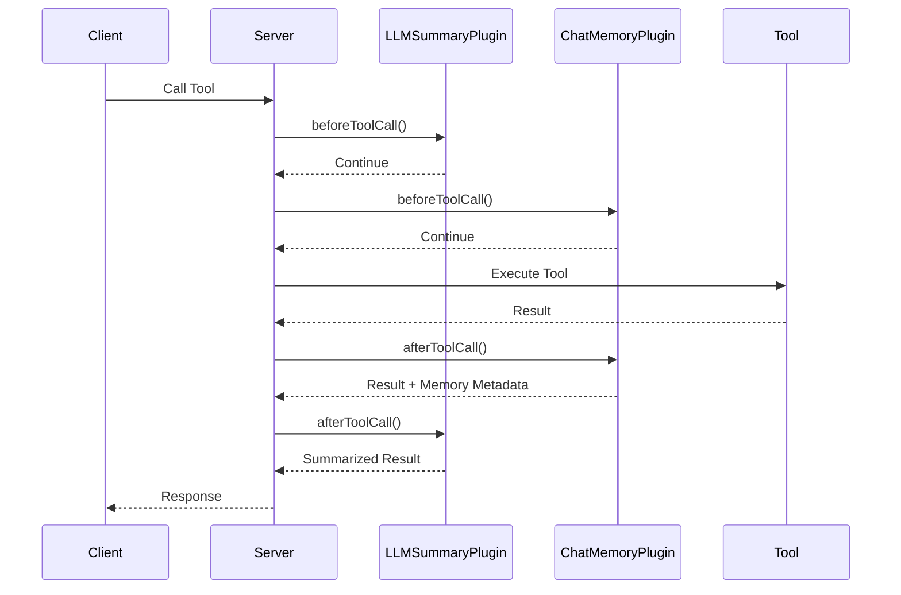

import { Callout, Cards, Card } from 'nextra/components'

# Plugin System

The MCP Proxy Wrapper features a powerful plugin architecture that allows you to extend MCP servers with additional functionality like AI enhancement, analytics, security, and more.

<Callout type="info">
  Plugins operate at the tool call level, intercepting requests before and after execution to add features without modifying your core tool logic.
</Callout>

## How Plugins Work

Plugins implement lifecycle hooks that are called during tool execution:

```typescript
export interface ProxyPlugin {
  name: string;
  version: string;
  
  // Called before tool execution
  beforeToolCall?(context: ToolCallContext): Promise<void | ToolCallResult>;
  
  // Called after tool execution  
  afterToolCall?(context: ToolCallContext, result: ToolCallResult): Promise<ToolCallResult>;
  
  // Plugin lifecycle
  initialize?(context: PluginContext): Promise<void>;
  destroy?(): Promise<void>;
}
```

## Available Plugins

<Cards>
  <Card
    title="LLM Summarization Plugin"
    href="#llm-summarization-plugin"
  >
    Automatically generate AI summaries of tool responses using OpenAI or mock providers.
  </Card>
  
  <Card
    title="Chat Memory Plugin"
    href="#chat-memory-plugin"
  >
    Save tool responses to memory and provide chat interface for interacting with saved data.
  </Card>
</Cards>

## Core Plugins

The following plugins are included in the core library:

### LLM Summarization Plugin

```typescript
import { LLMSummarizationPlugin } from 'mcp-proxy-wrapper';

const summaryPlugin = new LLMSummarizationPlugin();
summaryPlugin.updateConfig({
  options: {
    provider: 'openai', // or 'mock' for testing
    openaiApiKey: process.env.OPENAI_API_KEY,
    model: 'gpt-4o-mini',
    maxTokens: 150,
    temperature: 0.3,
    summarizeTools: ['search', 'research', 'analyze', 'fetch-data'],
    minContentLength: 100,
    saveOriginal: true
  }
});

// The plugin intercepts tool results and returns AI-generated summaries
// Original content is saved and can be retrieved later
// Works with both OpenAI API and mock provider for testing
```

### Chat Memory Plugin

```typescript
import { ChatMemoryPlugin } from 'mcp-proxy-wrapper';

const memoryPlugin = new ChatMemoryPlugin();
memoryPlugin.updateConfig({
  options: {
    provider: 'openai', // or 'mock' for testing
    openaiApiKey: process.env.OPENAI_API_KEY,
    model: 'gpt-4o-mini',
    saveResponses: true,
    enableChat: true,
    maxEntries: 1000,
    maxSessions: 100,
    sessionTimeout: 24 * 60 * 60 * 1000, // 24 hours
    excludeTools: ['chat-with-memory', 'get-memory-stats']
  }
});

// The plugin saves all tool responses to memory
// Provides chat interface to interact with saved data
// Supports searching and querying conversation history
```

## Plugin Categories

The plugin system supports several categories of functionality:

### AI Enhancement Plugins
LLM Summarization plugin provides AI-powered response summarization with configurable providers and models.

### Memory & Storage Plugins
Chat Memory plugin enables persistent storage of tool responses with intelligent search and chat interfaces.

### Extensible Architecture
The plugin system is designed to be extensible - you can create custom plugins by extending the BasePlugin class and implementing the required interfaces.

## Plugin Execution Flow



## Plugin Priorities

Plugins execute in priority order (higher numbers first):

```typescript
const proxiedServer = await wrapWithProxy(server, {
  plugins: [
    { plugin: memoryPlugin, priority: 20 },      // Memory plugin (higher priority)
    { plugin: summaryPlugin, priority: 10 }      // Summary plugin (lower priority)
  ]
});
```

## Quick Start

### 1. Install Plugin Dependencies

```bash
npm install mcp-proxy-wrapper
```

### 2. Import and Configure

```typescript
import { McpServer } from '@modelcontextprotocol/sdk/server/mcp.js';
import { wrapWithProxy, LLMSummarizationPlugin, ChatMemoryPlugin } from 'mcp-proxy-wrapper';

// Configure enhancement plugins
const summaryPlugin = new LLMSummarizationPlugin();
summaryPlugin.updateConfig({
  options: {
    provider: 'mock', // Use 'openai' with API key for production
    summarizeTools: ['search', 'analyze'],
    minContentLength: 50
  }
});

const memoryPlugin = new ChatMemoryPlugin();
memoryPlugin.updateConfig({
  options: {
    saveResponses: true,
    maxEntries: 100
  }
});

const proxiedServer = await wrapWithProxy(server, {
  plugins: [summaryPlugin, memoryPlugin]
});
```

### 3. Register Tools

```typescript
// Your tools are now enhanced with plugin functionality
proxiedServer.tool('research-analysis', {
  topic: z.string(),
  depth: z.enum(['basic', 'detailed']).default('basic'),
  userId: z.string().optional()
}, async (args) => {
  // Plugins handle summarization and memory automatically
  const research = await performResearch(args.topic, args.depth);
  return {
    content: [{ type: 'text', text: research }]
  };
});
```

## Error Handling

Plugins include robust error handling to ensure tool calls aren't broken by plugin failures:

```typescript
// Plugin errors are isolated and logged
try {
  await plugin.beforeToolCall(context);
} catch (error) {
  console.error('Plugin error:', error);
  // Tool call continues normally
}
```

## Plugin Configuration

### Environment-based Configuration

```typescript
const summaryPlugin = new LLMSummarizationPlugin();
summaryPlugin.updateConfig({
  options: {
    provider: process.env.NODE_ENV === 'production' ? 'openai' : 'mock',
    openaiApiKey: process.env.OPENAI_API_KEY,
    model: 'gpt-4o-mini',
    maxTokens: 150
  },
  enabled: true,
  priority: 10
});
```

### Dynamic Configuration

```typescript
const memoryPlugin = new ChatMemoryPlugin();
memoryPlugin.updateConfig({
  options: {
    maxEntries: process.env.NODE_ENV === 'production' ? 10000 : 100,
    sessionTimeout: 24 * 60 * 60 * 1000, // 24 hours
    enableChat: true,
    saveResponses: true
  },
  enabled: true,
  priority: 20
});
```

## Testing Plugins

The proxy wrapper includes testing utilities for plugin development:

```typescript
import { McpServer } from '@modelcontextprotocol/sdk/server/mcp.js';
import { wrapWithProxy, LLMSummarizationPlugin } from 'mcp-proxy-wrapper';

describe('LLM Summarization Plugin', () => {
  test('summarizes long content', async () => {
    const plugin = new LLMSummarizationPlugin();
    plugin.updateConfig({
      options: {
        provider: 'mock', // Use mock for testing
        minContentLength: 50,
        summarizeTools: ['test-tool']
      }
    });
    
    const proxiedServer = await wrapWithProxy(server, { plugins: [plugin] });
    
    const result = await proxiedServer.callTool('test-tool', { 
      text: 'This is a very long piece of content that should be summarized by the plugin because it exceeds the minimum length threshold.' 
    });
    
    expect(result.result._meta?.summarized).toBe(true);
    expect(result.result.content[0].text).toContain('Summary:');
  });
});
```

## Best Practices

### 1. **Plugin Isolation**
- Keep plugins independent and focused on single responsibilities
- Don't rely on other plugins' state or behavior
- Handle errors gracefully without breaking tool calls

### 2. **Performance**
- Minimize blocking operations in `beforeToolCall`
- Use async operations for external API calls
- Implement caching for expensive operations

### 3. **Configuration**
- Support environment-based configuration
- Provide sensible defaults
- Validate configuration on plugin initialization

### 4. **Logging**
- Use structured logging with appropriate levels
- Include context information (requestId, userId, etc.)
- Don't log sensitive information (API keys, personal data)

### 5. **Testing**
- Write unit tests for plugin logic
- Test integration with the proxy wrapper
- Include error scenarios and edge cases

## Community Plugins

The MCP community is building additional plugins. Community contributions are welcome for:

- Analytics and monitoring solutions
- Authentication and security plugins
- Performance optimization tools
- Integration plugins for popular services
- Custom business logic validators

Interested in contributing? See our plugin development guide below.

## Creating Your Own Plugin

Ready to build a custom plugin? Check out the plugin interface to get started:

<Cards>
  <Card
    title="ProxyPlugin Interface"
    href="/api-reference#proxyplugin"
  >
    Learn about the core plugin interface and required methods for building custom plugins.
  </Card>
  <Card
    title="Example Plugins"
    href="https://github.com/mcp-plugins/mcp-proxy-wrapper/tree/main/src/examples/plugins"
  >
    View the source code for the included plugins to understand implementation patterns.
  </Card>
</Cards>

<Callout type="success">
  **Ready to extend your MCP server?** Choose from our official plugins or create your own to add exactly the functionality you need.
</Callout>