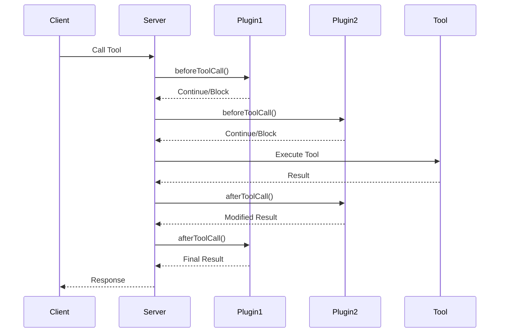

import { Callout, Cards, Card } from 'nextra/components'

# Plugin System

The MCP Proxy Wrapper features a powerful plugin architecture that allows you to extend MCP servers with additional functionality like monetization, analytics, security, and more.

<Callout type="info">
  Plugins operate at the tool call level, intercepting requests before and after execution to add features without modifying your core tool logic.
</Callout>

## How Plugins Work

Plugins implement lifecycle hooks that are called during tool execution:

```typescript
export interface ProxyPlugin {
  name: string;
  version: string;
  
  // Called before tool execution
  beforeToolCall?(context: ToolCallContext): Promise<void | ToolCallResult>;
  
  // Called after tool execution  
  afterToolCall?(context: ToolCallContext, result: ToolCallResult): Promise<ToolCallResult>;
  
  // Plugin lifecycle
  initialize?(context: PluginContext): Promise<void>;
  destroy?(): Promise<void>;
}
```

## Official Plugins

<Cards>
  <Card
    icon="💰"
    title="Stripe Monetization"
    href="/plugins/stripe-monetization"
  >
    Transform your AI tools into revenue-generating services with enterprise-grade billing, multiple payment models, and Stripe's hosted checkout.
  </Card>
  
  <Card
    icon="📊"
    title="Analytics & Monitoring"
    href="/plugins/analytics"
  >
    Track usage patterns, performance metrics, error rates, and user behavior with built-in dashboards and alerts.
  </Card>
  
  <Card
    icon="🔐"
    title="Authentication & Security"
    href="/plugins/authentication"
  >
    Add JWT authentication, API key management, and authorization controls to protect your tools and manage users.
  </Card>
  
  <Card
    icon="⚡"
    title="Caching & Performance"
    href="/plugins/caching"
  >
    Improve performance and reduce costs with intelligent caching strategies for tool responses and data.
  </Card>
  
  <Card
    icon="🛡️"
    title="Rate Limiting"
    href="/plugins/rate-limiting"
  >
    Protect against abuse with configurable rate limiting, burst allowances, and usage quotas.
  </Card>
  
  <Card
    icon="📝"
    title="Logging & Debugging"
    href="/plugins/logging"
  >
    Comprehensive logging with structured output, multiple destinations, and debugging tools.
  </Card>
</Cards>

## Plugin Categories

### 💰 **Monetization Plugins**
- **Stripe Monetization**: Complete billing solution with multiple payment models
- **Usage-based Billing**: Pay-per-use pricing for API tools
- **Subscription Management**: Recurring billing and plan management
- **Credit Systems**: Token-based prepaid systems

### 🔐 **Security & Authentication Plugins**  
- **JWT Authentication**: Token-based user authentication
- **API Key Management**: Secure API access control
- **OAuth Integration**: Third-party authentication providers
- **Request Validation**: Input sanitization and validation

### 📊 **Analytics & Monitoring Plugins**
- **Usage Analytics**: Tool usage tracking and behavior analysis
- **Performance Monitoring**: Response times, error rates, and throughput
- **Business Intelligence**: Revenue metrics, user insights, and trends
- **Error Tracking**: Exception monitoring and alerting

### ⚡ **Performance & Optimization Plugins**
- **Response Caching**: Intelligent caching with TTL and invalidation
- **Load Balancing**: Distribute requests across multiple backends
- **Circuit Breaker**: Fault tolerance and graceful degradation
- **Request Compression**: Reduce bandwidth usage

### 🎯 **Utility & Integration Plugins**
- **Request Transform**: Modify requests and responses
- **Data Validation**: Schema validation and type checking
- **Retry Logic**: Automatic retry with exponential backoff
- **Webhook Integration**: Event-driven notifications

## Plugin Execution Flow



## Plugin Priorities

Plugins execute in priority order (higher numbers first):

```typescript
const proxiedServer = await wrapWithProxy(server, {
  plugins: [
    { plugin: authPlugin, priority: 1000 },      // Auth first
    { plugin: analyticsPlugin, priority: 500 },  // Analytics 
    { plugin: billingPlugin, priority: 100 }     // Billing last
  ]
});
```

## Quick Start

### 1. Install Plugin Dependencies

```bash
npm install mcp-proxy-wrapper
```

### 2. Import and Configure

```typescript
import { wrapWithProxy } from 'mcp-proxy-wrapper';
import { createStripeMonetizationPlugin } from 'mcp-proxy-wrapper/plugins/stripe-monetization';

const plugin = createStripeMonetizationPlugin({
  stripeSecretKey: process.env.STRIPE_SECRET_KEY!,
  defaultPrice: 100 // $1.00 per call
});

const proxiedServer = await wrapWithProxy(server, {
  plugins: [plugin]
});
```

### 3. Register Tools

```typescript
// Your tools are now enhanced with plugin functionality
proxiedServer.tool('expensive-ai-analysis', {
  text: z.string()
}, async (args) => {
  // Plugin handles billing, auth, analytics automatically
  return await performAIAnalysis(args.text);
});
```

## Error Handling

Plugins include robust error handling to ensure tool calls aren't broken by plugin failures:

```typescript
// Plugin errors are isolated and logged
try {
  await plugin.beforeToolCall(context);
} catch (error) {
  logger.error('Plugin error:', error);
  // Tool call continues normally
}
```

## Plugin Configuration

### Environment-based Configuration

```typescript
const plugin = createStripeMonetizationPlugin({
  stripeSecretKey: process.env.STRIPE_SECRET_KEY!,
  environment: process.env.NODE_ENV === 'production' ? 'live' : 'test',
  debug: process.env.DEBUG === 'true'
});
```

### Dynamic Configuration

```typescript
const plugin = createAnalyticsPlugin({
  providers: ['datadog', 'newrelic'],
  metrics: {
    enabled: true,
    retention: '30d'
  },
  alerts: {
    errorRate: 0.05,
    latency: 1000
  }
});
```

## Testing Plugins

The proxy wrapper includes testing utilities for plugin development:

```typescript
import { createTestEnvironment } from 'mcp-proxy-wrapper/testing';

describe('My Plugin', () => {
  test('blocks unauthorized calls', async () => {
    const env = createTestEnvironment();
    await env.addPlugin(myAuthPlugin);
    
    await expect(env.callTool('protected-tool', {}))
      .rejects.toThrow('Authentication required');
  });
});
```

## Best Practices

### 1. **Plugin Isolation**
- Keep plugins independent and focused on single responsibilities
- Don't rely on other plugins' state or behavior
- Handle errors gracefully without breaking tool calls

### 2. **Performance**
- Minimize blocking operations in `beforeToolCall`
- Use async operations for external API calls
- Implement caching for expensive operations

### 3. **Configuration**
- Support environment-based configuration
- Provide sensible defaults
- Validate configuration on plugin initialization

### 4. **Logging**
- Use structured logging with appropriate levels
- Include context information (requestId, userId, etc.)
- Don't log sensitive information (API keys, personal data)

### 5. **Testing**
- Write unit tests for plugin logic
- Test integration with the proxy wrapper
- Include error scenarios and edge cases

## Community Plugins

The MCP community maintains a growing ecosystem of plugins:

- **Discord Notifications**: Send alerts to Discord channels
- **Slack Integration**: Post tool usage to Slack
- **Database Logging**: Store tool calls in databases
- **OpenTelemetry**: Distributed tracing and metrics
- **Custom Validators**: Business logic validation

[Browse community plugins →](https://github.com/mcp-community/plugins)

## Creating Your Own Plugin

Ready to build a custom plugin? Our plugin development guide walks you through everything from basic setup to advanced patterns.

<Cards>
  <Card
    icon="🛠️"
    title="Creating Custom Plugins"
    href="/plugins/creating-plugins"
  >
    Learn how to build your own plugins from scratch with our comprehensive guide.
  </Card>
  
  <Card
    icon="🌟"
    title="Community Plugins"
    href="/plugins/community"
  >
    Explore plugins built by the community and contribute your own.
  </Card>
</Cards>

<Callout type="success">
  **Ready to extend your MCP server?** Choose from our official plugins or create your own to add exactly the functionality you need.
</Callout>